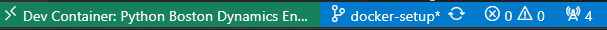

# Initial Setup

## Start Container

1. Press F1 and select **"Dev Containers: Reopen in Container"**
2. Wait for the container to build and start (first time may take a few minutes)

**Your bottom bar should include a similar element.**



## Configure Python Interpreter
After the container is running:
1. Open a terminal in VS Code
2. Run `which python` to check the current Python interpreter
3. **If the output is NOT** `/app/.venv/bin/python`
    - Press F1
    - Select **"Python: Select Interpreter"**
    - Choose `/app/.venv/bin/python` from the list

## Verify Setup
Confirm everything is working:
```bash
which python
# Should show: /app/.venv/bin/python

make qa-check
# Should run your quality checks
```

## Troubleshooting
- If Python features don't work, reload VS Code: **F1 → "Developer: Reload Window"**
- To rebuild the container: **F1 → "Dev Containers: Rebuild Container"**
---

## Development Commands

### Environment Management

| Command                                  | Description                               |
|------------------------------------------|-------------------------------------------|
| ```make create-venv```                   | Create Python virtual environment         |
| ```make use-venv```                      | Activate virtual environment in new shell |
| ```make check-venv-using```              | Check if virtual environment is active    |
| ```make install```                       | Install project dependencies              |

### Code Quality & Testing
| Command                                  | Description                                    |
|------------------------------------------|------------------------------------------------|
| ```make test```                          | Run all tests with pytest                      |
| ```make lint```                          | Run code quality checks (flake8)               |
| ```make format```                        | Auto-format code with black                    |
| ```make qa-check```                      | Run format + lint + tests (full quality check) |

### Maintenance
| Command                                  | Description                                    |
|------------------------------------------|------------------------------------------------|
| ```make clean```                         | Remove cache and temporary files               |
| ```make help```                          | Show all available commands                    |

---

## Daily Development Workflow

**Starting work**
```bash
make use-venv
```

or 

```bash
make run
```

**Before committing code**
```bash
make qa-check
```

**Installing new dependencies**
1. Add package to requirements.txt
2. Run:
```bash
make install
```

**Running tests only**
```bash
make test
```

---

## Verify Everything Works

```bash
# Check which Python is being used
which python # Expected output: /app/.venv/bin/python

# OR check if the virtual environment is active
make check-venv-using # Expected output: Virtual environment is active.

# Run a test script
python test.py # Expected output: Hello World!
```
---

## Troubleshooting

### Virtual Environment Issues
+ **Not activated:** Run `make use-venv`
+ **Check status:** Run `make check-venv-using`
+ **Recreate:** Delet `.venv` folder and run `make create-venv`

### Dependency Issues
```bash
make clean
make install
```

### Test Failures
+ Run `make test` to see detailed failure information
+ Check test files in `tests/` directory
--- 

## Best Practices
+ Always work in the virtual environment (your prompt should show)
+ Run `make qa-check` before committing
+ Add new dependencies to `requirements.txt`
+ Use `make format` to maintain consistent code style