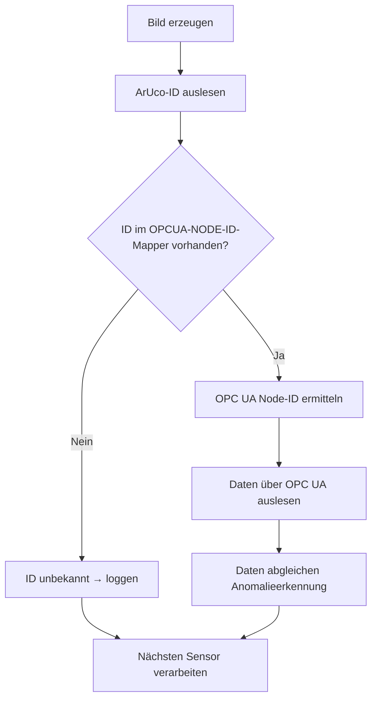

## Architecture

Das Problem besteht darin, das man für ddie Anomalie Erkennung, die Digitalen Sensorwerte mit den von OPCUA abgleichen muss.

## Mögliches Lösungskonzept Flowchart

```mermaid

flowchart TD

    A[Bild erzeugen] --> B[ArUco-ID auslesen]

    B --> C{ID im OPCUA-NODE-ID-Mapper vorhanden?}

    C -->|Nein| N[ID unbekannt → loggen]
    N --> O[Nächsten Sensor verarbeiten]

    C -->|Ja| D[OPC UA Node-ID ermitteln]

    D --> E[Daten über OPC UA auslesen]

    E --> F[Daten abgleichen Anomalieerkennung]

    F --> O[Nächsten Sensor verarbeiten]
```