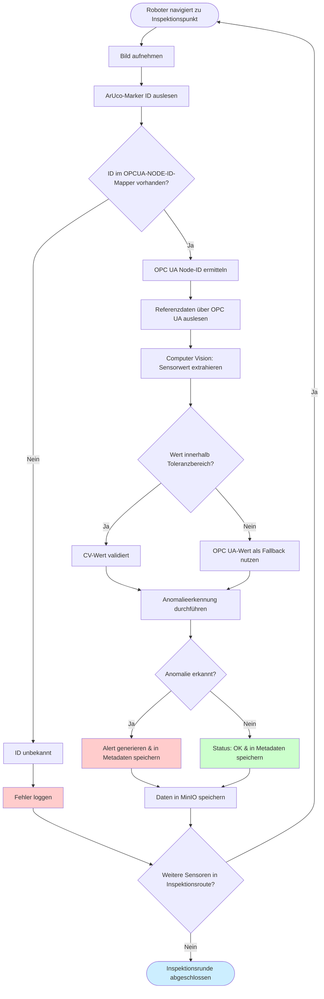

## Architektur

### Datenvalidierung und Anomalieerkennung

Das System nutzt einen zweistufigen Validierungsansatz zur Gewährleistung der Datenqualität:

**Primäre Datenquelle: Computer Vision**
Die vom Roboter visuell erfassten Sensordaten werden zunächst mit den entsprechenden OPC UA-Referenzwerten abgeglichen. Für jeden Sensor ist ein definierter Toleranzbereich konfigurierbar, der spezifische Messabweichungen und Umgebungseinflüsse berücksichtigt.

**Validierungslogik:**
- **Innerhalb der Toleranz**: Die visuell ausgelesenen Daten werden als valide eingestuft und für die Anomalieerkennung verwendet
- **Außerhalb der Toleranz**: Bei Abweichungen außerhalb des definierten Bereichs werden die OPC UA-Daten als Referenz herangezogen, um False Positives durch Auslesefehler zu vermeiden

Dieser hybride Ansatz kombiniert die Flexibilität der bildbasierten Inspektion mit der Zuverlässigkeit direkter Sensorabfragen und minimiert das Risiko fehlerhafter Anomaliemeldungen durch ungünstige Lichtbedingungen oder Verschmutzungen der Anzeigen.

---

## Lösungskonzept Flowchart

### Inspektions- und Datenerfassungsprozess

### Prozessbeschreibung

**Phase 1: Bilderfassung & Identifikation**
- Kamerabasierte Aufnahme des Sensorbereichs
- ArUco-Marker dienen als eindeutige Sensor-Identifikatoren und ermöglichen präzise Zuordnung

**Phase 2: Datenabgleich**
- Mapping der ArUco-ID auf die entsprechende OPC UA Node-ID
- Paralleles Auslesen von Referenzdaten (OPC UA) und visuellen Daten (Computer Vision)

**Phase 3: Validierung & Anomalieerkennung**
- Toleranzbasierter Vergleich beider Datenquellen
- Fallback-Mechanismus bei CV-Fehlern
- Regelbasierte Anomalieerkennung

**Phase 4: Persistierung**
- Objektspeicherung (MinIO): Originalbilder, verarbeitete Bilder
- Metadatenspeicher: Siehe Dokumentationsordner `images/datasink`